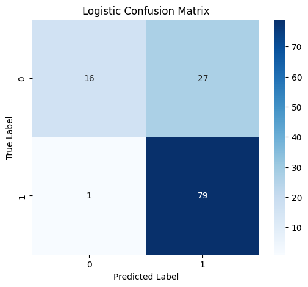
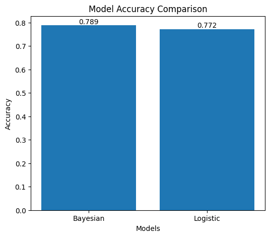

# 🧠 AI-Based Loan Approval Expert System

A hybrid AI-powered expert system designed to predict loan approval decisions using multiple artificial intelligence techniques including rule-based reasoning, probabilistic inference, machine learning, and search algorithms.

---

## 🚀 Features

- ✅ Rule-Based Knowledge System
- ✅ Bayesian Probabilistic Reasoning (Naive Bayes)
- ✅ Machine Learning Model (Logistic Regression)
- ✅ Hybrid Decision Engine (Combined AI Logic)
- ✅ Explainable AI (Decision Reasoning)
- ✅ Risk Scoring System
- ✅ Applicant Ranking using Search Algorithm
- ✅ Model Evaluation (Accuracy, Precision, Recall, F1 Score)
- ✅ Visualization (Confusion Matrix & Model Comparison)

---

## 📊 Dataset

- 📁 Source: Kaggle Loan Prediction Dataset
- 🔗 Dataset Link: https://www.kaggle.com/datasets/altruistdelhite04/loan-prediction-problem-dataset
- 📌 Includes applicant details such as:
  - Income
  - Loan Amount
  - Credit History
  - Employment Status
  - Property Area

---

## 🧠 AI Techniques Used

### 🔹 Rule-Based System
Implements expert-defined rules for decision making.

### 🔹 Bayesian Reasoning
Handles uncertainty using probability-based classification.

### 🔹 Machine Learning
Uses Logistic Regression for prediction and classification.

### 🔹 Hybrid Decision System
Combines outputs from:
- Rule-Based System
- Bayesian Model
- ML Model  
→ Produces a final decision with confidence level.

### 🔹 Explainable AI
Provides reasons behind predictions such as:
- Good credit history
- High income
- Low loan amount

---

## 📈 Model Performance

| Model | Accuracy | Precision | Recall | F1 Score |
|------|---------|----------|--------|----------|
| Naive Bayes | ~0.78 | ~0.74 | ~0.97 | ~0.85 |
| Logistic Regression | ~0.78 | ~0.74 | ~0.98 | ~0.85 |

---

## 📊 Visualization

### 🔹 Bayesian Confusion Matrix

### 🔹 Logistic Regression Confusion Matrix

### 🔹 Model Accuracy Comparison

---

## ⚙️ Technologies Used

- 🐍 Python
- 📊 Pandas & NumPy
- 🤖 Scikit-learn
- 📈 Matplotlib & Seaborn

---

## 🎯 Output

- Loan Approval Decision (Approved / Rejected)
- Confidence Level (High / Uncertain)
- Explanation (Reason-based output)
- Risk Score
- Ranked Applicants

---

## ⚖️ Ethical Considerations

- Bias in financial datasets
- Need for transparency in decisions
- Accountability of AI predictions

---

## 📄 Report

You can access the full project report below:

- 📥 [Download PDF Report](report.pdf?raw=true)
- 📖 [View Report Online](report.pdf)

The report includes:
- System architecture
- AI workflow diagrams
- Model evaluation
- Ethical analysis

---

## 👨‍💻 Author

**Abir Hasan**  
CSE Student, IUBAT  

---

## ⭐ Final Note

This project demonstrates a complete AI-based decision support system combining multiple intelligent techniques to solve a real-world financial problem.
